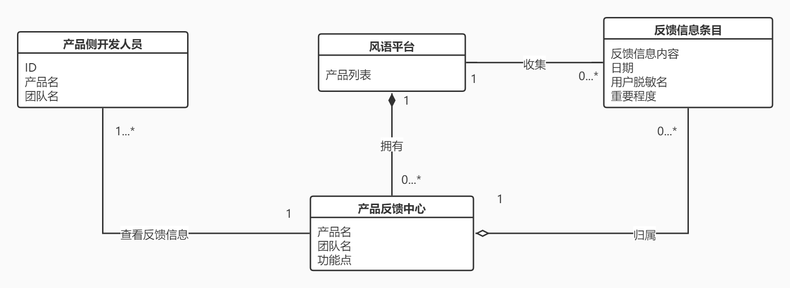

## todo

1. 类图（领域模型）与代表行为的顺序图与状态图 √
2. 写自己负责目标模型的需求跟踪矩阵，包括用户需求及其对应的系统需求、填写跟踪矩阵√
3. **总体描述的用户特征**√
4. 详细需求描述的功能需求，写自己对应目标模型的用例**对应功能的分析即可**√
5. **详细需求描述的性能需求**√

## 获取反馈信息

### 1 领域模型

下图描述了获取反馈信息中的类关系。

该图有产品侧开发人员、产品反馈中心、风语平台以及反馈信息条目四个类组成。其中产品侧开发人员和产品反馈中心是“查看反馈信息”的关联关系；风语平台和产品反馈中心是组合关系；风语平台和反馈信息条目是“收集”的关联关系；产品反馈中心和反馈信息条目是聚合关系。各个类拥有的信息如图所示。

### 2 顺序图

下图描述了获取反馈信息过程中产品侧开发人员和系统的交互过程序列。

该顺序图展示了产品侧开发人员获取反馈信息的过程。首先产品侧开发人员向风语平台发出查看反馈信息请求，风语平台得到请求，根据产品名称向对应的产品反馈中心发出请求。产品反馈中心拥有反馈信息条目，循环查找得到所有功能点的反馈信息条目，并返回给风语平台。风语平台将反馈信息给产品侧开发人员进行展示。最后如果产品侧开发人员需要排序或者按关键字查找，则进行对应处理并返回展示。

### 3 状态图

下图描述了获取反馈信息中用例的状态和流转情况。

首先开始进入搜索反馈信息状态，当搜索完成后，我们进入展示反馈信息状态。如果我们进行关键字查找，则进行查找，且状态不改变，仍是展示反馈信息状态；同理，如果进行排序，则进行按重要程度排序，且依旧状态不改变。最终当产品侧开发人员选择退出后进入退出状态。

## 2. 总体描述

### 2.3 用户特征

针对上一小节用户识别的结果，对每一类用户描述如下：

| 用户           | 一般特征                                                     | 主要目标                                                     | 受教育水平 | 经验和技术水平 |
| -------------- | ------------------------------------------------------------ | ------------------------------------------------------------ | ---------- | -------------- |
| 软件产品用户   | 来自各个年龄段，为不同软件的使用者，他们可能是使用智能手机的老手，能够快速上手各类软件；也有可能他们不熟悉如何使用智能手机，对于软件的使用一窍不通，希望能够快速使用。同时有轻度使用者，他们不常使用目标软件，也有重度使用者，对于软件使用深入，对于软件有着自己的建议与理解，希望能够提出自己的建议。有的在使用的过程中遇到了问题，不知道如何解决，需要人工来帮助解决特定问题。 | 能够快速了解软件的全部功能以及使用的方式，顺畅地没有错误地帮助他们完成任务。 | 一般       | 较低           |
| 产品侧开发人员 | 处于软件开发初创阶段，资金与人员有限，需要集中关注软件的功能需求，无法构建自己的用户反馈平台，但是十分需要用户反馈来帮助后续开发。同时希望能够给用户良好的软件使用导引。 | 得到有效地用户反馈信息来指导后续的平台开发。                 | 高         | 高             |
| 产品侧客服人员 | 为用户提供解答，但是用户提问不准确往往使得他们十分烦恼。连续十几个小时的工作以及回复繁琐重复的问题让他们工作充满了疲惫。 | 能够高效轻松的获取用户的问题以及精确地回答                   | 一般       | 一般           |
| 系统管理员     | 平台运维，是社区的管理者，他们往往不太需要直接和其他用户进行沟通，但是作为平台的中坚力量负责把控着社区的质量，关系到社区的质量和健壮成长。 | 能够快速发现社区中存在的问题并解决                           | 一般       | 较高           |

## 3.详细需求描述

### 3.2 功能需求

#### 3.2.3 获取反馈信息

#### 3.2.3.1 特征描述

获取反馈信息是辅助产品侧开发人员迭代改进产品的最主要功能，开发人员通过风语平台获取对应产品的全部功能点的反馈信息，并且可以排序以及按照关键字进行查找。

#### 3.2.3.2 刺激/相应序列

- 刺激：开发人员请求进入团队下某产品反馈中心
- 响应：系统跳转到产品反馈中心界面
- 刺激：开发人员请求获取反馈信息列表
- 响应：系统提示获取中，完成后展示反馈信息列表
- 刺激：开发人员对已有的反馈信息列表输入关键字并请求查找
- 响应：系统提示查找中，完成后展示查找结果
- 刺激：开发人员对已有的反馈信息列表请求排序
- 响应：系统展示排序后的结果
- 刺激：开发人员对已有的反馈信息列表请求导出
- 响应：系统提示导出中，完成后提示导出完成

#### 3.2.3.3 相关功能需求

| 功能             | 描述                                                         |
| ---------------- | ------------------------------------------------------------ |
| Feedback.request | 系统在接受开发人员获取反馈信息的请求后，获取反馈信息列表     |
| Feedback.search  | 系统在反馈信息列表中接到开发人员搜索请求，根据关键字搜索并展示 |
| Feedback.sort    | 系统在反馈信息列表中接到开发人员排序请求，排序并展示         |
| Feedback.export  | 系统在接受开发人员请求导出列表时，导出列表信息               |

### 3.3 性能需求

Performance1. 软件产品用户搜索问题反馈时间不多于0.5s。

Performance2. 平台最少支持10万用户同时发起咨询客服请求。

Performance3. 社区内容至少支持3年内的帖子信息存储。

Performance4. 产品侧开发人员搜索得到反馈信息列表时间不少于1s。

Performance5. 平台支持在线用户人数至少为100w。

Performance6. 处理完成软件产品用户发帖时间不多于0.5s。

## 跟踪矩阵

UR3. 获取反馈信息

SR3. 

- 1）系统根据产品名称获取产品对应的反馈信息列表
- 2）系统可以通过关键字对反馈信息列表进行查找
- 3）系统可以对列表进行排序
- 4）系统可以导出列表

<table>
	<head>
		<tr>
			<th align="center" colspan="3" rowspan="2">原始信息</th>
            <th align="center" colspan="7">过程信息</th>
            <th align="center" colspan="3" rowspan="2">处理信息</th>
            <th align="center" colspan="3" rowspan="2">变更信息</th>
		</tr>
       	<tr>
			<th align="center" colspan="3">需求是否可实现</th>
            <th align="center" colspan="4">需求是否符合规划目标</th>
		</tr>
        <tr>
			<th align="center">需求编号</th>
            <th align="center">需求类别</th>
            <th align="center">需求来源</th>
            <th align="center">具有难度</th>
            <th align="center">可行性</th>
            <th align="center">风险</th>
            <th align="center">改善产品功能</th>
            <th align="center">改善产品性能</th>
            <th align="center">增加用户满意度</th>
            <th align="center">增加产品竞争力</th>
            <th align="center">是否实现</th>
            <th align="center">优先级</th>
            <th align="center">未实现原因</th>
            <th align="center">是否出现变更</th>
            <th align="center">变更基线</th>
            <th align="center">变更记录</th>
		</tr>
	</head>
    <body>
		<tr>
			<td>UR3</td>
			<td>用户需求</td>
			<td>客户</td>
			<td>否</td>
            <td>可行</td>
			<td>无</td>
			<td>是</td>
			<td>否</td>
            <td>是</td>
			<td>否</td>
			<td>实现</td>
			<td>高</td>
            <td></td>
			<td>否</td>
			<td></td>
			<td></td>
		</tr>
        <tr>
			<td>SR3</td>
			<td>系统需求</td>
			<td>客户</td>
			<td>否</td>
            <td>可行</td>
			<td>无</td>
			<td>是</td>
			<td>否</td>
            <td>是</td>
			<td>否</td>
			<td>实现</td>
			<td>高</td>
            <td></td>
			<td>否</td>
			<td></td>
			<td></td>
		</tr>
	</body>
</table>

